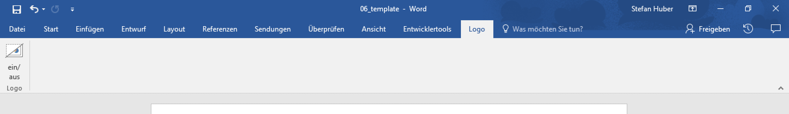

## Word-Scripts

Script to copy image-formatting from InDesign to Word

### `copyPicFormat`
copy a formatting of a picture form InDesign (`.jsx`) to Word (`.vbs`)

### `multipleTemplates`
Generate multiple Templates based on the open document. Past in the prompt you data to replace in each new Template;

Pasted data (tab separated):

| First       | Second     |
| ----------- | ---------- |
| Content A1  | Content B1 |
| Content A2  | Content B2 |

Replaces in the Doc `{{First}} {{Second}}` with `Content A1 Content B1`. The resulting filename of the new template will be `{{First}}.dotm`.

### Customize the Word User Interface (Ribbon)
Example:

* [Handmade](https://msdn.microsoft.com/en-us/vba/office-shared-vba/articles/customize-the-office-fluent-ribbon-by-using-an-open-xml-formats-file)
* With [Custom UI Editor](http://gregmaxey.com/word_tip_pages/customize_ribbon_main.html)
* [Download Custom UI Editor](http://openxmldeveloper.org/blog/b/openxmldeveloper/archive/2006/05/26/customuieditor.aspx)

### References
See also:
* https://github.com/flekst/Trista-DPI

### Status
This is only a set of test-scripts. use at your own risk. :)
